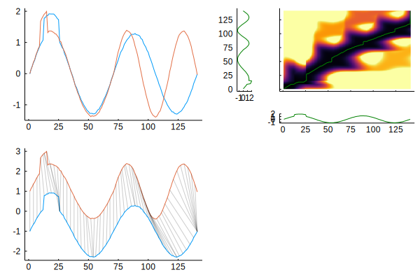
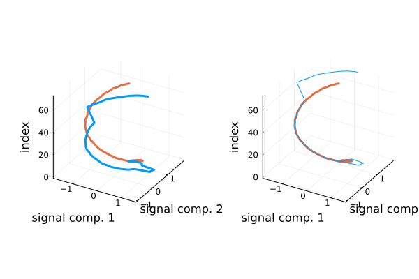
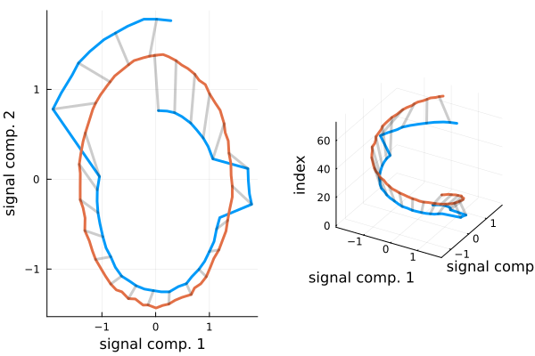
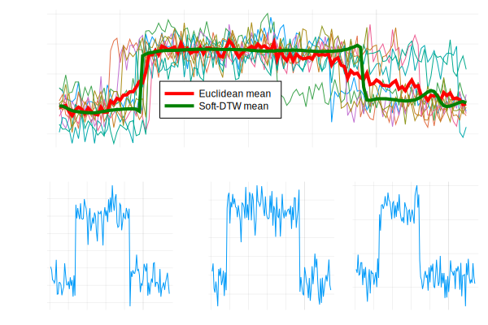

# DynamicAxisWarping.jl

[](https://github.com/baggepinnen/DynamicAxisWarping.jl/actions)
[](https://codecov.io/gh/baggepinnen/DynamicAxisWarping.jl)
[](https://juliahub.com/docs/DynamicAxisWarping/)

Dynamic Time Warping (DTW), matrix profile and related algorithms in Julia.

[Dynamic Time Warping](https://en.wikipedia.org/wiki/Dynamic_time_warping) is a method used to compare, or measure the "distance" between two signals. Contrary to, e.g., the Euclidean distance between two signals, which operates point-wise, DTW compares the signals by warping them in time to produce the closest possible match, with the constraint that the warping is monotonic. Underneath the hood, DTW solves an $\mathcal{O}(n^2)$ dynamic-programming problem, and can thus be computationally expensive if implemented and used naively. This package attempts at providing a fairly well-optimized implementation, and further supports some well-known tricks to reduce the computational complexity, such as limiting the maximum allowed warping (radius) etc., effectively reducing the complexity to $\mathcal{O}(nr)$ where $r$ is the radius. DTW does not require the two signals under comparison to have the same length, making it a widely applicable measure of (dis)similarity.

This package supports arbitrary metrics and arbitrary "spaces", i.e., as long as you are passing a vector or higher dimensional array of something that your distance can operate on, you're good to go. Time is always considered to be the last dimension.

This package is registered and can be installed with:
```julia
using Pkg
pkg"add DynamicAxisWarping"
```

## Simple usage

Inputs of dimension larger than 1 will be treated as sequences where time is in the last dimension. When using higher-dimensional series, make sure the provided distance accepts them.

Any distance implementing the [Distances.jl](https://github.com/JuliaStats/Distances.jl) interface works, as well as functions on the form `dist(x,y) -> ℝ`.

```julia
using DynamicAxisWarping, Distances, Plots
cost, i1, i2 = dtw(a,b, [dist=SqEuclidean()]; transportcost = 1)
cost, i1, i2 = fastdtw(a,b, dist, radius) # note https://arxiv.org/abs/2003.11246
cost = dtw_cost(a, b, dist, radius) # Optimized method that only returns cost. Supports early stopping, see docstring. Can be made completely allocation free.

# dtw supports arbitrary upper and lower bound vectors constraining the warping path.
imin,imax = radiuslimits(5,20,20), plot([imin imax])
dtw(a, b, dist, imin, imax) # Cost equivalent to dtw_cost(a, b, dist, 5)

# The Distances.jl interface is supported
d = DTW(radius=5)
d(a,b)
```

## Plotting
```julia
dtwplot(a, b, [dist=SqEuclidean()]; transportcost = 1)
matchplot(a, b, [dist=SqEuclidean()])
matchplot2(a, b, [dist=SqEuclidean()])
```
Example:
```julia
using DynamicAxisWarping, Plots

fs = 70
t  = range(0,stop=1,step=1/fs)
y0 = sin.(2pi .*t)
y1 = sin.(3pi .*t)
y  = [y0;y1[2:end]] .+ 0.01 .* randn.()
q  = [y0;y0[2:end]] .+ 0.01 .* randn.()
y[10:15] .+= 0.5
q[13:25] .+= 0.5

f1 = plot([q y])
f2 = dtwplot(q,y,lc=:green, lw=1)
f3 = matchplot(q,y,ds=3,separation=1)
plot(f1,f2,f3, legend=false, layout=3, grid=false)
```


Example, two-dimension timeseries, simple example

```julia
using DynamicAxisWarping, Plots, Distances

# Create signals q(u) ∈ ℜ², y(u) ∈ ℜ²
fs = 70
u  = collect(range(0,stop=1,step=1/fs))
# Create a template query signal
q, tq = [sin.(2pi .* u) cos.(2pi .* u)] .+ 0.01 .* randn.(), u
# Create a similar signal
y = [sin.(3pi .*u)  cos.(3pi .* u)] .+ 0.01 .* randn.()
last_peak = findlast(isapprox.(y[:,2], maximum(y[:,2]),atol=0.05))
y, ty = y[1:last_peak, :], u[1:last_peak]
y[end-10:end,:] .+= q[end-10:end,:]
y[10:13] .+= 0.5

# Plot signals
kws = (;linewidth=3, zlabel="index", xlabel="signal comp. 1", ylabel="signal comp. 2",
	   xticks=-1:1:1, yticks=-1:1:1, asepct_ratio=1, legend=nothing)
cs, cq = theme_palette(:auto).colors.colors[1:2]
orig= plot(eachcol(q)...,1:size(q,1); c=cq, label="query", kws...)
plot!(eachcol(y)..., 1:size(y,1) ; c=cs, label="similar signal", kws...)

# Warp 2D time signals and visualize
cost, i1, i2 = dtw(y', q', SqEuclidean(); transportcost = 1)
kws=(;kws..., legend=nothing)
warped=plot(eachcol(q[i2,:])..., 1:length(i2); c=cq, label="query", kws...);
plot!(eachcol(y[i1,:])..., 1:length(i1); c=cs, label="signal", kws..., linewidth=1);
plot(orig, warped)
```



```julia
# Visualizing matched ℜ² signal points in ℜ²
kws=(;kws..., legend=nothing, ds=3, separation=0, xlabel="signal comp. 1", ylabel="signal comp. 2")
mp1 = matchplot2(y', q'; kws...)
# Or in ℜ³ with a signal index axis
mp2 = matchplot2(y', q'; showindex=true, zlabel="warped signal index", kws...)
plot(mp1, mp2)
```



## Find a short pattern in a long time series
The function `dtwnn` searches for a pattern in a long time series. By default, it *does not normalize* the data over each window, to do this, pass, e.g., `ZNormalizer` as the fifth argument.

```julia
using DynamicAxisWarping, Distances, Plots
radius = 5
a      = sin.(0.1 .* (1:100))     .+ 0.1 .* randn.()
b      = sin.(0.1 .* (1:100_000)) .+ 0.1 .* randn.()
res    = dtwnn(a, b, SqEuclidean(), radius, saveall=false, bsf_multiplier=1) # takes < 0.1s # DynamicAxisWarping.DTWSearchResult(0.4625287975222824, 73452, (prune_end = 79108, prune_env = 0))
plot([a b[eachindex(a) .+ (res.loc-1)]])
```

- `saveall` causes the entire distance profile to be computed. This will take longer time to compute. It is stored in `res.dists`.
- `bsf_multiplier = 1`: If > 1, require lower bound to exceed `bsf_multiplier*best_so_far`. This allows you to find several nearby points without having to compute the entire distance profile.
- Available normalizers are: `ZNormalizer, DiagonalZNormalizer, NormNormalizer`

### Multi-threaded search
Below is an example of how several long series `y ∈ Y` can be searched for the occurance of query `q` in a multithreaded fashion, using `tmap` from [ThreadTools.jl](https://github.com/baggepinnen/ThreadTools.jl). In this example, we first create a unique workspace object for each thread to save on allocations
```julia
using ThreadTools
const workspaces = map(1:Threads.nthreads()) do i
    DTWWorkspace(q, dist, radius)
end
@time results = tmap(Y) do y
    dtwnn(workspaces[Threads.threadid()], y, showprogress = false)
end
mincost, minind = findmin(results) # special method for Vector{DTWSearchResult}
```


### Optimizations
The following optimizations are implemented.
- [x] Endpoint lower bound pruning
- [x] Envelope lower bound pruning
- [x] DTW early termination
- [x] Online normalization (see `ZNormalizer`)
- [ ] Sorting of query series
- [x] All algorithms operate on arbitrary precision numbers. If you pass them `Float32` instead of `Float64`, they can become up to twice as fast.

`dtwnn` is fairly performant, below is a small benchmark performed on a 2014 laptop
```julia
a = sin.(0.1f0 .* (1:100))    .+ 0.1f0 .* randn.(Float32)
b = sin.(0.1f0 .* (1:1000_000)) .+ 0.1f0 .* randn.(Float32)
@btime dtwnn($a, $b, SqEuclidean(), 5, ZNormalizer, prune_endpoints = true, prune_envelope = true)
# 853.336 ms (25519 allocations: 5.00 MiB)
```

## Differentiable Soft-DTW
The [Soft-DTW](https://arxiv.org/pdf/1703.01541.pdf) algorithm is provided through the function
```julia
soft_dtw_cost(a, b, [SqEuclidean()]; γ = 1, transportcost = 1)
```
`γ` is the smoothing parameters and a smaller value of `γ` makes the distance closer to the standard DTW distance.

To differentiate w.r.t. the first argument, try
```julia
using ReverseDiff
da = ReverseDiff.gradient(a->soft_dtw_cost(a,b; γ=1), a)
```
Zygote.jl will not work due to the array-mutation limitation.
See also function `soft_dtw_cost_matrix`.

The following [example](https://github.com/baggepinnen/DynamicAxisWarping.jl/blob/master/examples/softDTW.jl) illustrates how to calculate a barycenter (generalized average) using Soft DTW and [Optim.jl](https://github.com/JuliaNLSolvers/Optim.jl), the result is shown below, together with three instances of the input series



## Generalized DTW

The `gdtw` function implements the algorithm from [*A General Optimization Framework for Dynamic Time Warping*](https://arxiv.org/abs/1905.12893), which takes two continuous-time signals `x` and `y` on the interval `[0,1]`, and warps them by means of warping functions `ϕ, ψ`, so that `x ∘ ϕ ≈ y ∘ ψ`, where either
`ψ(s) = 2s - ϕ(s)` (both signals warped symmetrically, the default), or `ψ(s)=s` (only the `x` signal is warped). The method allows regularization by imposing penalties on `ϕ(t) - t` (the "cumulative warping") and on `ϕ'(t) - 1` (the "instantaneous warping").

```julia
using LinearAlgebra
ts = range(0, stop=4π, length=128)
x = LinearInterpolation(sin.(ts) .+ 0.1 .* randn.())
y = LinearInterpolation(sin.(1.1 .* ts))

norm(x.(ts) - y.(ts)) # 1.7184237220575787

cost, ϕ, ψ = gdtw(x,y)

norm(x.(ϕ.(ts)) - y.(ψ.(ts))) # 0.9266090849096682

```

## Clustering and barycenter averaging
```julia
barycenter = dba(vector_of_arrays)
result     = dbaclust(data, nclust, DTW())
```
Note that `dba` is known to not always produce the best barycenters. See, e.g., `soft_dtw_cost` above and ["Soft-DTW: a Differentiable Loss Function for Time-Series"](https://arxiv.org/pdf/1703.01541.pdf) or ["Spatio-Temporal Alignments: Optimal transport through space and time"](https://arxiv.org/pdf/1910.03860.pdf) for a method that produces better barycenters at the expense of a much higher computational cost.

## Sparse distance matrix
The early termination and some of the stopping heuristics can be used to efficiently calculate a sparse distance matrix where only the k nearest neighbors are fully caluclated and stored. To this end, we have the function
```julia
dists, inds = sparse_distmat(y::Vector{Vector}, k, dist, radius)
```

## Matrix Profile
This package defines specialized methods for [`MatrixProfile`](https://github.com/baggepinnen/MatrixProfile.jl)`.matrix_profile`, making use of early stopping to accelerate the computation of the matrix profile. The interface is
```julia
profile = matrix_profile(y, m, DTW(radius, [transportcost]))
```


## `transportcost`
`transportcost` adds an additional penalty multiplier for "transporting", i.e., deviations from the Euclidean matching. The standard DTW distance does not consider this added cost and the default is 1. A value greater than 1 multiplies the cost of moving horizontally or vertically in the coupling matrix, promoting a diagonal move, corresponding to the standard Euclidean matching. The influence of the transport cost can be visualized with
```julia
using DynamicAxisWarping, Plots
a = sin.(1:100); b = sin.(1:100) .+ randn.();
dtwplot(a,b, transportcost=1)    # Default
dtwplot(a,b, transportcost=1.01) # Should be "more diagonal"
dtwplot(a,b, transportcost=1.1)  # Should be almost completely diagonal
```
You can try a `transportcost < 1` as well, but then it is preferable to make weird alignments and I'm not sure how much sense that would make.

See also the keyword argument `postprocess` that allows you to pass a function `D_modified = f(D)` that is used to filter/post-process the cost matrix. Low-pass filtering can be used to effectively remove small-scale warping.


## Combine with optimal transport
The distance between two datapoints can be any distance supporting the [Distances.jl](https://github.com/JuliaStats/Distances.jl/) interface.

See the file [`frequency_warping.jl`](https://github.com/baggepinnen/DynamicAxisWarping.jl/blob/master/examples/frequency_warping.jl) ([notebook](https://nbviewer.jupyter.org/github/baggepinnen/julia_examples/blob/master/frequency_warping.ipynb)) for an example combining dynamic time warping with optimal transport along the frequency axis for spectrograms. This example makes use of [SpectralDistances.jl](https://github.com/baggepinnen/SpectralDistances.jl).

## Distances.jl interface

```julia
d = DTW(radius=radius, dist=SqEuclidean()) # Or FastDTW / SoftDTW
d(a,b)
```

## Signal alignment
See [SignalAlignment.jl](https://github.com/baggepinnen/SignalAlignment.jl) which uses this package to align out-of-sync signals and signals with different sample rates.

## Acknowledgements

This package is a fork of https://github.com/ahwillia/TimeWarp.jl which is no longer maintained.

Special thanks to Joseph Fowler ([@joefowler](https://github.com/joefowler)) who contributed a substantial portion of the initial code for TimeWarp.jl
